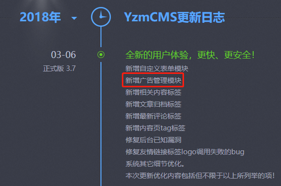
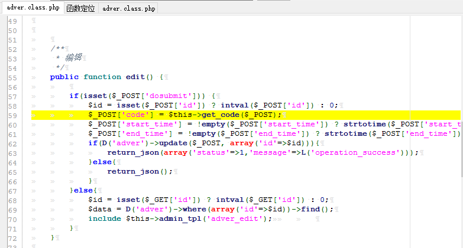
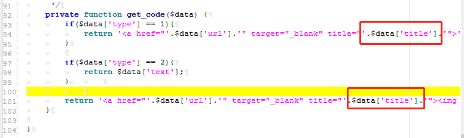
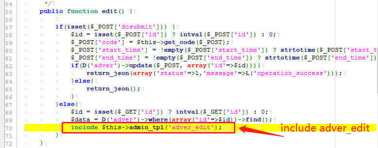
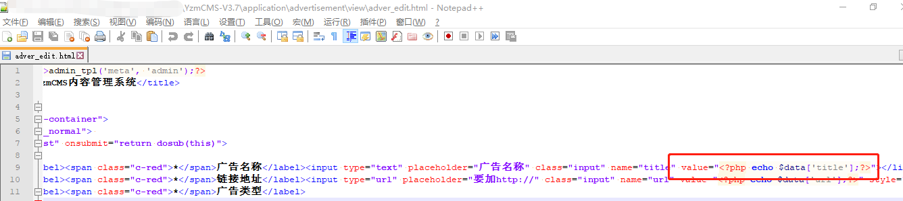
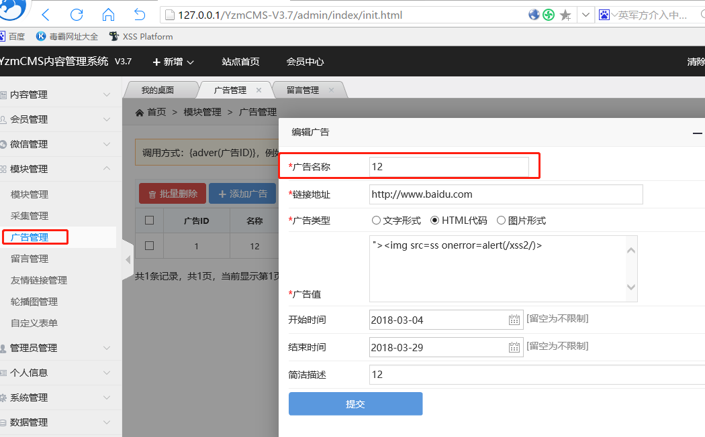
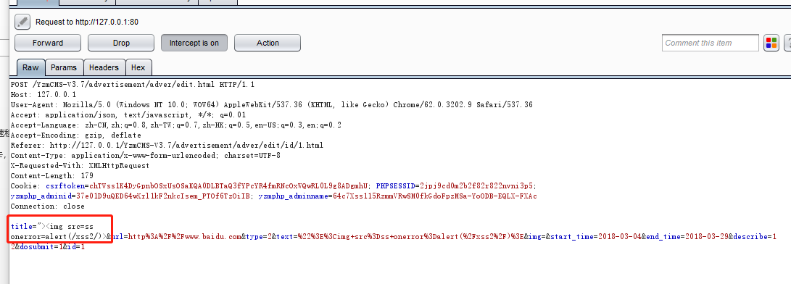
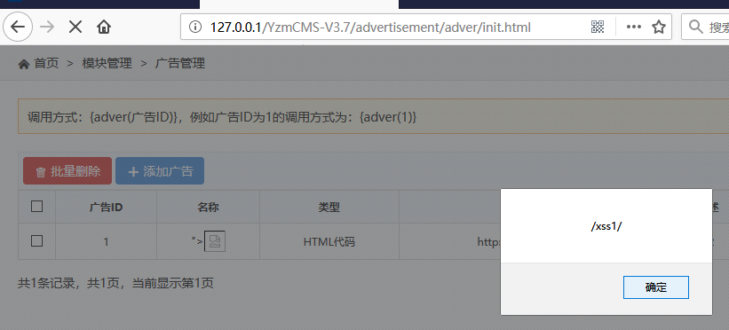

# YZMCMSxss CVE-2018-8078
YZMCMS v3.7最新版xss漏洞

YZMCMS V3.7 Stored XSS

这个xss存在于v3.7新增的广告管理模块，如图所示:

This xss exists in v3.7 new advertising management module, as shown in the figure:

 

我们可以在YzmCMS-V3.7\application\advertisement\controller\adver.class.php第55-70行中找到广告管理编辑功能的具体代码，如图所示：

We can find the specific code of the ad management editing function in YzmCMS-V3.7\application\advertisement\controller\adver.class.php, lines 55-70, as shown in the figure:

 

其中，在第59行调用了一个名为getcode的方法，用POST方法传递了一组参数，我们继续跟进该方法，该方法返回一个$data[‘title’]没有进行任何的过滤，直接作为参数return到$POST_[‘code’]中，如图所示：

Among them, a method named getcode is called on line 59, a set of parameters is passed using the POST method, and we continue to follow the method. This method returns a $data['title'] without any filtering directly. Return the parameter to $POST_[‘code’] as shown:



我们返回edit继续往下跟进，在edit方法中有include包含了一个名为adver_edit的文件如图所示：

Let's go back to edit and continue to follow. In the edit method include includes a file called adver_edit as shown in the figure:



我们可以在YzmCMS-V3.7\application\advertisement\view该路径下找到该文件，可以看到至此，yzmcms并未对数据进行任何过滤，直接输出到页面中，如图所示：

We can find the file in the path of YzmCMS-V3.7\application\advertisement\view. You can see that yzmcms does not filter any data and outputs it directly to the page, as shown in the following figure:



我们可以在后台管理界面找到该功能，如图所示：

We can find this function in the background management interface, as shown in the figure:



点击提交后我们可以用burp拦截该数据包，将title改为```">```，点击发送，如图所示：

After submitting, we can use burp to intercept the data packet and change the title to ```">```. Click Send, as shown:



我们返回广告管理界面，刷新，此时xss弹框可见，如图所示：

We return to the ad management interface, refresh, at this time the xss bullet is visible, as shown:


